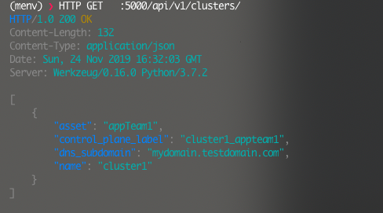
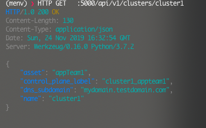
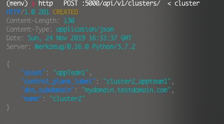
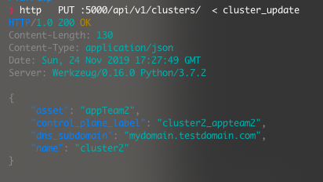
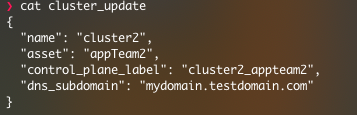

# DATOS


Datos is a simple CMDB that can be used to store infrastructure reference data.  This can be used to help you get started developing a CMDB and can be easily expanded to fit your needs.

Technology Stack
- Flask-RestPlus
- SQLAlchemy
- Postgres


## Postgres installation

### MAC instructions
```
brew install postgresql  

pg_ctl -D /usr/local/var/postgres start

createdb datos

psql -d datos
```

Follow operating system specific instructions for your environment.

Update config.py with the correct database endpoint information if not running on localhost.

##  Application setup
git clone https://github.com/osumano/datos.git
(create a virtualenv - best practice)
```
pip install -r requirements.txt

export PYTHONPATH='.:../'

FLASK_APP=app.py

FLASK_ENV=development

python db_init.py

flask run
```

## Execute Unit Tests

```
pytest --disable-warnings -s

```

## REST calls
Swagger URL http://yoururl:5000/api/v1/

### GET /api/v1/clusters


### GET /api/v1/cluster1


### POST /api/v1/cluster



### PUT  /api/v1/cluster


### JSON file example

